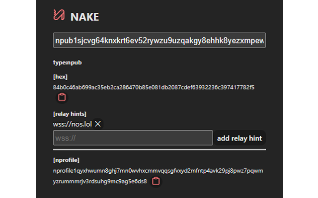
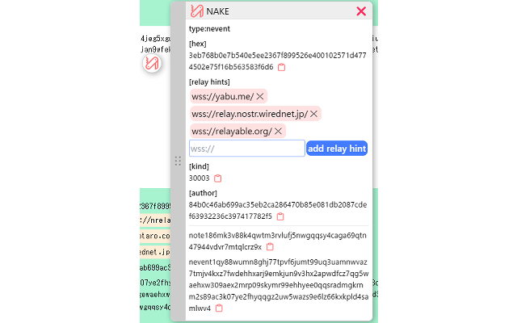

# nake

Nostr Army Knife webExtension

- conversion between nostr hexid and NIP-19 (bech32-encoded entities)

- conversion between  nsec and ncryptsec (NIP-49)

- link to njump me

- Enter the Unix timestamp in seconds in the pop-up and it converts to local time.

[Chrome Web Store](https://chromewebstore.google.com/detail/nake/pckmdjknadbfalfohabbccmffoohlamk)

[Firefox Addon Store](https://addons.mozilla.org/ja/firefox/addon/nake/)

## 使い方

release の zip をブラウザの拡張機能ページのパッケージ化されていない拡張機能を読み込むで読み込む

スマホでも使えるやつでは使える

スマホでは範囲選択（文字長押し）したあともう一回適当にクリックしたらアイコンが出てくると思います

#### popupsample

#### contentsample

## license

- [pocket-knife icon]

  ISC License

  Copyright (c) for portions of Lucide are held by Cole Bemis 2013-2022 as part of Feather (MIT). All other copyright (c) for Lucide are held by Lucide Contributors 2022.

  (https://github.com/lucide-icons/lucide/blob/main/LICENSE )

- [clipboard-check-line icon] [clipboard-line icon]

  MIT License

  Copyright (c) 2021 Gerrit Halfmann

  (https://github.com/halfmage/majesticons/blob/main/LICENSE)

- [dots-six-vertical-bold icon]

  MIT License

  Copyright (c) 2023 Phosphor Icons

  (https://github.com/lucide-icons/lucide/blob/main/LICENSE)

- [open-in-new-rounded icon]

  Apache License Version 2.0, January 2004

  (https://github.com/google/material-design-icons/blob/master/LICENSE)